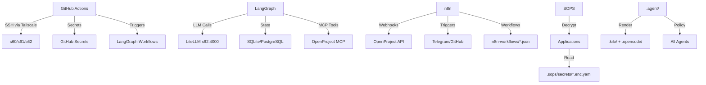

# Agents Projects Context — Complete Technology Map

**Version:** 1.0.0  
**Last Updated:** 2026-04-06  
**Repository:** https://github.com/pkoka888/op.expc.cz  
**Scope:** LangGraph, LiteLLM, GitHub Actions, SOPS/Age, n8n, Agent Architecture

---

## 1. Executive Summary

### System Architecture Overview

```
Internet → Firewall (89.203.173.196) → s61 Traefik → s60/s62 Services
                                    ↓
                         Tailscale (100.64.0.0/10)
                         ├── s60: Application Host (OpenProject, n8n)
                         ├── s61: Edge Proxy (Traefik, Monitoring)
                         └── s62: Backup/AI Gateway (LiteLLM, Loki)
                                    ↓
                         GitHub Actions → Tailscale → All Servers
```

### Technology Stack

| Component          | Technology          | Purpose                                      | Location             |
| ------------------ | ------------------- | -------------------------------------------- | -------------------- |
| **Orchestration**  | LangGraph + FastAPI | Workflow automation, audit, rollback         | `langgraph_app/`     |
| **AI Gateway**     | LiteLLM             | Model routing, fallback, cost optimization   | s62:4000             |
| **CI/CD**          | GitHub Actions      | Automated testing, deployment, monitoring    | `.github/workflows/` |
| **Secrets**        | SOPS + Age          | Encryption, vault management                 | `.sops/`             |
| **Automation**     | n8n                 | Workflow automation, OpenProject integration | s60:5678             |
| **Governance**     | Canonical Agents    | Policy enforcement, skill registry           | `.agent/`            |
| **Infrastructure** | Ansible + Docker    | Configuration management, containerization   | `infrastructure/`    |

### Integration Points



---

## 2. LangGraph Orchestration

### Architecture & Components

**Repository Path:** `langgraph_app/`  
**API URL:** `http://100.111.141.111:8093` (Tailscale-only)  
**Swagger UI:** `http://100.111.141.111:8093/docs`  
**Container:** `langgraph_app-langgraph-app-1`  
**Port:** 8093

#### Core Files

| File                                  | Purpose                                     | URL                                                                                  |
| ------------------------------------- | ------------------------------------------- | ------------------------------------------------------------------------------------ |
| `langgraph_app/app.py`                | FastAPI application with workflow endpoints | https://github.com/pkoka888/op.expc.cz/blob/main/langgraph_app/app.py                |
| `langgraph_app/config.py`             | LiteLLM configuration, model selection      | https://github.com/pkoka888/op.expc.cz/blob/main/langgraph_app/config.py             |
| `langgraph_app/graph/audit.py`        | Server audit workflow definition            | https://github.com/pkoka888/op.expc.cz/blob/main/langgraph_app/graph/audit.py        |
| `langgraph_app/graph/rollback.py`     | Rollback workflow definition                | https://github.com/pkoka888/op.expc.cz/blob/main/langgraph_app/graph/rollback.py     |
| `langgraph_app/state/audit_state.py`  | Audit state schema                          | https://github.com/pkoka888/op.expc.cz/blob/main/langgraph_app/state/audit_state.py  |
| `langgraph_app/nodes/audit_nodes.py`  | Audit node implementations                  | https://github.com/pkoka888/op.expc.cz/blob/main/langgraph_app/nodes/audit_nodes.py  |
| `langgraph_app/nodes/mcp_tools.py`    | MCP tool bindings                           | https://github.com/pkoka888/op.expc.cz/blob/main/langgraph_app/nodes/mcp_tools.py    |
| `langgraph_app/checkpointers/base.py` | Checkpoint saver implementations            | https://github.com/pkoka888/op.expc.cz/blob/main/langgraph_app/checkpointers/base.py |
| `langgraph_app/hooks/pre_tool_use.py` | Pre-execution hooks                         | https://github.com/pkoka888/op.expc.cz/blob/main/langgraph_app/hooks/pre_tool_use.py |
| `langgraph_app/requirements.txt`      | Python dependencies                         | https://github.com/pkoka888/op.expc.cz/blob/main/langgraph_app/requirements.txt      |
| `langgraph_app/docker-compose.yml`    | Docker deployment                           | https://github.com/pkoka888/op.expc.cz/blob/main/langgraph_app/docker-compose.yml    |
| `langgraph_app/.env.example`          | Environment template                        | https://github.com/pkoka888/op.expc.cz/blob/main/langgraph_app/.env.example          |

#### Workflows

| Workflow     | Endpoint                  | Purpose                             | Nodes                                                                                                                        |
| ------------ | ------------------------- | ----------------------------------- | ---------------------------------------------------------------------------------------------------------------------------- |
| **Audit**    | `POST /workflow/audit`    | Server health, security, compliance | init → collect_facts → analyze_security → check_compliance → request_approval → generate_report → finalize                   |
| **Rollback** | `POST /workflow/rollback` | Safe deployment rollback            | init_rollback → capture_snapshot → verify_backup → request_rollback_approval → execute_rollback → verify_rollback → finalize |

#### State Management

- **Checkpointing:** SQLite (dev) / PostgreSQL (prod)
- **Thread Isolation:** `thread_id` in config
- **HITL Support:** `interrupt_before` parameter
- **State Persistence:** MemorySaver (dev) / PostgresSaver (prod)

#### API Usage Examples

```bash
# Health check
curl http://100.111.141.111:8093/health

# List workflows
curl http://100.111.141.111:8093/workflow/graphs

# Run audit
curl -X POST http://100.111.141.111:8093/workflow/audit \
  -H "Content-Type: application/json" \
  -d '{"target_server": "s60", "audit_type": "security"}'

# Run rollback
curl -X POST http://100.111.141.111:8093/workflow/rollback \
  -H "Content-Type: application/json" \
  -d '{"rollback_target": "openproject-web", "backup_id": "backup-2026-04-05"}'
```

#### Testing

| Test File                                                | Purpose                    | URL                                                                                                     |
| -------------------------------------------------------- | -------------------------- | ------------------------------------------------------------------------------------------------------- |
| `langgraph_app/tests/test_litellm_integration.py`        | LiteLLM integration tests  | https://github.com/pkoka888/op.expc.cz/blob/main/langgraph_app/tests/test_litellm_integration.py        |
| `langgraph_app/tests/integration/test_audit_workflow.py` | Audit workflow integration | https://github.com/pkoka888/op.expc.cz/blob/main/langgraph_app/tests/integration/test_audit_workflow.py |
| `langgraph_app/tests/unit/test_state_schemas.py`         | State schema validation    | https://github.com/pkoka888/op.expc.cz/blob/main/langgraph_app/tests/unit/test_state_schemas.py         |
| `langgraph_app/tests/unit/test_checkpointers.py`         | Checkpointer tests         | https://github.com/pkoka888/op.expc.cz/blob/main/langgraph_app/tests/unit/test_checkpointers.py         |
| `langgraph_app/tests/unit/test_hooks.py`                 | Hook execution tests       | https://github.com/pkoka888/op.expc.cz/blob/main/langgraph_app/tests/unit/test_hooks.py                 |

---

## 3. LiteLLM AI Gateway

### Deployment on s62

**Host:** s62 (100.91.164.109)  
**Port:** 4000 (Tailscale-only)  
**Container:** `marketing-litellm`  
**Database:** PostgreSQL on s62:35432  
**Cache:** Redis on s62:36379

#### Configuration Files

| File                                                        | Purpose                      | URL                                                                                                        |
| ----------------------------------------------------------- | ---------------------------- | ---------------------------------------------------------------------------------------------------------- |
| `langgraph_app/config.py`                                   | LiteLLM client configuration | https://github.com/pkoka888/op.expc.cz/blob/main/langgraph_app/config.py                                   |
| `docs/guides/litellm-integration.md`                        | Integration guide            | https://github.com/pkoka888/op.expc.cz/blob/main/docs/guides/litellm-integration.md                        |
| `infrastructure/ansible/files/litellm-proxy-config-v3.yaml` | LiteLLM proxy configuration  | https://github.com/pkoka888/op.expc.cz/blob/main/infrastructure/ansible/files/litellm-proxy-config-v3.yaml |
| `infrastructure/ansible/litellm-deploy.yml`                 | Ansible deployment playbook  | https://github.com/pkoka888/op.expc.cz/blob/main/infrastructure/ansible/litellm-deploy.yml                 |

#### Model Configuration & Fallback Chain

```python
# Primary: LiteLLM on s62 (routes to 100+ models)
LITELLM_BASE_URL = "http://192.168.1.62:4000/v1"

# Fallback chain: litellm → openrouter → groq
PROVIDERS = {
    "litellm": {
        "base_url": "http://192.168.1.62:4000/v1",
        "models": {
            "fast": "deepseek/deepseek-chat",
            "smart": "anthropic/claude-3.5-sonnet",
            "coding": "deepseek/deepseek-coder",
            "reasoning": "deepseek/deepseek-reasoner",
        },
        "fallback_provider": "openrouter",
    },
    "openrouter": {
        "base_url": "https://openrouter.ai/api/v1",
        "models": {
            "fast": "anthropic/claude-3-haiku",
            "smart": "anthropic/claude-3.5-sonnet",
            "coding": "anthropic/claude-3-opus",
            "reasoning": "openai/o1-mini",
        },
        "fallback_provider": "groq",
    },
    "groq": {
        "base_url": "https://api.groq.com/openai/v1",
        "models": {
            "fast": "llama-3.1-8b-instant",
            "smart": "llama-3.3-70b-versatile",
            "coding": "mixtral-8x7b-32768",
        },
        "fallback_provider": None,
    },
}
```

#### Task-Based Model Selection

```python
TASK_MODEL_MAP = {
    "audit": ("coding", "deepseek/deepseek-coder"),
    "code": ("coding", "deepseek/deepseek-coder"),
    "review": ("coding", "deepseek/deepseek-coder"),
    "reason": ("reasoning", "deepseek/deepseek-reasoner"),
    "analysis": ("reasoning", "deepseek/deepseek-reasoner"),
    "complex": ("smart", "anthropic/claude-3.5-sonnet"),
    "planning": ("smart", "anthropic/claude-3.5-sonnet"),
    "simple": ("fast", "deepseek/deepseek-chat"),
    "fast": ("fast", "deepseek/deepseek-chat"),
    "default": ("fast", "deepseek/deepseek-chat"),
}
```

#### Available Models (Free Tier)

| Provider   | Model ID             | Recommended Use        |
| ---------- | -------------------- | ---------------------- |
| Groq       | groq-llama-8b        | General / High speed   |
| Groq       | groq-qwen-32b        | Coding / Reasoning     |
| Cerebras   | cerebras-llama-8b    | Ultra-fast latency     |
| Mistral    | mistral-small-latest | General (EU Sovereign) |
| OpenRouter | or-deepseek-chat     | Long context           |
| Gemini     | gemini-2.5-flash     | 1M Context Window      |

#### Connection Details

- **Base URL:** `http://192.168.1.62:4000/v1`
- **Master Key:** Retrieved from s62's vault (never commit plaintext)
- **Authentication:** Bearer token in Authorization header
- **Protocol:** OpenAI-compatible API

#### Verification Commands

```bash
# Test connectivity from s60
curl -s http://192.168.1.62:4000/v1/models

# Test model inference
curl -s http://192.168.1.62:4000/v1/chat/completions \
  -H "Authorization: Bearer $LITELLM_API_KEY" \
  -H "Content-Type: application/json" \
  -d '{"model": "deepseek/deepseek-chat", "messages": [{"role": "user", "content": "Hello"}]}'
```

---

## 4. GitHub Actions CI/CD

### Workflow Inventory

| Workflow                     | File                                             | Purpose                              | Trigger           |
| ---------------------------- | ------------------------------------------------ | ------------------------------------ | ----------------- |
| **Health Check**             | `.github/workflows/health-check.yml`             | Server health monitoring every 30min | Schedule + Manual |
| **LangGraph Dispatch**       | `.github/workflows/langgraph-dispatch.yml`       | Manual workflow execution            | Manual            |
| **LangGraph Security Audit** | `.github/workflows/langgraph-security-audit.yml` | Automated security audits            | Manual            |
| **Backup Verify**            | `.github/workflows/backup-verify.yml`            | Backup restoration testing           | Schedule          |
| **Cert Expiry**              | `.github/workflows/cert-expiry.yml`              | SSL certificate monitoring           | Schedule          |
| **Config Drift**             | `.github/workflows/config-drift.yml`             | Configuration drift detection        | Schedule          |
| **Deploy**                   | `.github/workflows/deploy.yml`                   | Production deployments               | Manual            |
| **Infra Validate**           | `.github/workflows/infra-validate.yml`           | Infrastructure validation            | Manual            |

### Security Hardening

#### Action Pinning (MANDATORY)

All third-party actions MUST be pinned to full commit SHA:

```yaml
# ✅ REQUIRED
- uses: actions/checkout@11bd71901bbe5b1630ceea73d27597364c9af683 # v4.2.2

# ❌ FORBIDDEN
- uses: actions/checkout@v4
- uses: actions/checkout@main
```

#### Permissions (MANDATORY)

```yaml
permissions:
  contents: read

jobs:
  deploy:
    permissions:
      packages: write # Only elevate where needed
```

### Tailscale Integration

```yaml
- name: Join Tailscale
  uses: tailscale/github-action@v4
  with:
    oauth-client-id: ${{ secrets.TS_OAUTH_CLIENT_ID }}
    oauth-secret: ${{ secrets.TS_OAUTH_SECRET }}
    tags: tag:ci
    ping: 100.111.141.111,100.119.73.81,100.91.164.109
```

### LangGraph Integration in CI

```yaml
- name: Run LangGraph Security Audit
  run: |
    curl -s --max-time 60 -X POST http://100.111.141.111:8093/workflow/audit \
      -H "Content-Type: application/json" \
      -d '{"target_server": "${{ matrix.server.name }}", "audit_type": "security"}' \
      -o /tmp/audit_result.json || true

    if [ -s /tmp/audit_result.json ]; then
      echo "=== LangGraph Audit for ${{ matrix.server.name }} ==="
      jq -r '.status, .findings_count // 0' /tmp/audit_result.json 2>/dev/null || echo "Parse error"
    else
      echo "::warning::LangGraph API unreachable"
    fi
```

### Secrets Management in GitHub Actions

| Secret               | Purpose                  | Used In                      |
| -------------------- | ------------------------ | ---------------------------- |
| `TS_OAUTH_CLIENT_ID` | Tailscale OAuth          | All workflows                |
| `TS_OAUTH_SECRET`    | Tailscale OAuth          | All workflows                |
| `DEPLOY_SSH_KEY`     | SSH access to servers    | health-check.yml, deploy.yml |
| `LANGGRAPH_PROD`     | LangGraph production key | langgraph-dispatch.yml       |
| `OPENAI_API_KEY`     | OpenAI API key           | langgraph-dispatch.yml       |

### Environment Protection Rules

- **Production deployments** require manual approval
- **Branch restrictions** apply to main branch
- **Required reviewers** configured for production environment

### Workflow Files

| File                                             | Lines | Purpose                                             | URL                                                                                             |
| ------------------------------------------------ | ----- | --------------------------------------------------- | ----------------------------------------------------------------------------------------------- |
| `.github/workflows/health-check.yml`             | 83    | Server health monitoring with LangGraph integration | https://github.com/pkoka888/op.expc.cz/blob/main/.github/workflows/health-check.yml             |
| `.github/workflows/langgraph-dispatch.yml`       | 79    | Manual LangGraph workflow dispatch                  | https://github.com/pkoka888/op.expc.cz/blob/main/.github/workflows/langgraph-dispatch.yml       |
| `.github/workflows/langgraph-security-audit.yml` | -     | Security audit workflow                             | https://github.com/pkoka888/op.expc.cz/blob/main/.github/workflows/langgraph-security-audit.yml |
| `.github/workflows/backup-verify.yml`            | -     | Backup verification                                 | https://github.com/pkoka888/op.expc.cz/blob/main/.github/workflows/backup-verify.yml            |
| `.github/workflows/cert-expiry.yml`              | -     | Certificate expiry monitoring                       | https://github.com/pkoka888/op.expc.cz/blob/main/.github/workflows/cert-expiry.yml              |
| `.github/workflows/config-drift.yml`             | -     | Configuration drift detection                       | https://github.com/pkoka888/op.expc.cz/blob/main/.github/workflows/config-drift.yml             |
| `.github/workflows/deploy.yml`                   | -     | Production deployment                               | https://github.com/pkoka888/op.expc.cz/blob/main/.github/workflows/deploy.yml                   |
| `.github/workflows/infra-validate.yml`           | -     | Infrastructure validation                           | https://github.com/pkoka888/op.expc.cz/blob/main/.github/workflows/infra-validate.yml           |

---

## 5. Secrets Management (SOPS + Age)

### Architecture & Encryption

**Technology:** SOPS + Age (Mozilla + Filippo Valsorda)  
**Encryption:** Age public key encryption (X25519)  
**Status:** ✅ Operational since 2026-04-05  
**Migration:** From Ansible Vault to SOPS + Age

#### Age Key Details

- **Private key:** `~/.config/sops/age/keys.txt` (NEVER commit)
- **Public key:** `age10j83qpjzwup04f02enfrqdcy5hfshtyx98swckmvh4zg578qayxs5jmdra`
- **Environment:** `SOPS_AGE_KEY_FILE` (optional, defaults to `~/.config/sops/age/keys.txt`)

### Vault Structure

```
.sops/
├── README.md                           # Documentation
├── .sops.yaml                          # Encryption config
├── scripts/
│   ├── unlock.sh                       # Decrypt and export to environment
│   └── lock.sh                         # Clear environment variables
└── secrets/
    ├── api-keys.enc.yaml               # API keys (Groq, OpenRouter, Gemini, etc.)
    ├── api-keys-v2.enc.yaml            # API keys v2
    ├── application-secrets.enc.yaml    # App secrets (JWT, encryption keys, etc.)
    ├── application-secrets-v2.enc.yaml # App secrets v2
    ├── database-credentials.enc.yaml   # DB passwords and connection details
    ├── database-credentials-v2.enc.yaml# DB credentials v2
    ├── github-tokens.enc.yaml          # GitHub tokens and deploy keys
    ├── github-tokens-v2.enc.yaml       # GitHub tokens v2
    ├── op-expc-project.enc.yaml        # OpenProject secrets
    └── ssh-keys.enc.yaml               # SSH keys
```

### Configuration Files

| File                                  | Purpose                       | URL                                                                                  |
| ------------------------------------- | ----------------------------- | ------------------------------------------------------------------------------------ |
| `.sops.yaml`                          | SOPS encryption configuration | https://github.com/pkoka888/op.expc.cz/blob/main/.sops.yaml                          |
| `.sops/README.md`                     | SOPS vault documentation      | https://github.com/pkoka888/op.expc.cz/blob/main/.sops/README.md                     |
| `.sops/scripts/unlock.sh`             | Decrypt and export secrets    | https://github.com/pkoka888/op.expc.cz/blob/main/.sops/scripts/unlock.sh             |
| `.sops/scripts/lock.sh`               | Clear environment variables   | https://github.com/pkoka888/op.expc.cz/blob/main/.sops/scripts/lock.sh               |
| `scripts/verify-secrets-migration.sh` | Migration verification        | https://github.com/pkoka888/op.expc.cz/blob/main/scripts/verify-secrets-migration.sh |

### Encrypt/Decrypt Operations

#### Quick Start

```bash
# Unlock vault (exports secrets as SOPS_* env vars)
source .sops/scripts/unlock.sh

# Use secrets
echo $SOPS_GROQ_API_KEY

# Lock vault (clears all SOPS_* env vars)
source .sops/scripts/lock.sh
```

#### Adding New Secrets

```bash
# 1. Create plaintext file: .sops/secrets/my-secrets.yaml
# 2. Encrypt: sops -e -i .sops/secrets/my-secrets.yaml
# 3. Rename: mv .sops/secrets/my-secrets.yaml .sops/secrets/my-secrets.enc.yaml
# 4. Verify: sops -d .sops/secrets/my-secrets.enc.yaml
```

#### Decrypting Specific Files

```bash
# View decrypted content
sops -d .sops/secrets/api-keys.enc.yaml

# Export to environment
source .sops/scripts/unlock.sh
```

### Integration with Applications

#### Environment Variables Pattern

Secrets are exported with `SOPS_` prefix:

```bash
# After unlock
$SOPS_GROQ_API_KEY
$SOPS_OPENROUTER_API_KEY
$SOPS_LANGGRAPH_LITELLM_API_KEY
$SOPS_OP_EXPC_OPENPROJECT_API_KEY
```

#### GitHub Actions Integration

```yaml
- name: Decrypt secrets
  run: |
    echo "${{ secrets.SOPS_AGE_KEY }}" > ~/.config/sops/age/keys.txt
    chmod 600 ~/.config/sops/age/keys.txt
    source .sops/scripts/unlock.sh
```

### Migration from Ansible Vault

| Ansible Vault           | SOPS + Age                       |
| ----------------------- | -------------------------------- |
| `.vault/secrets/*.yml`  | `.sops/secrets/*.enc.yaml`       |
| `~/.vault-password`     | `~/.config/sops/age/keys.txt`    |
| `ansible-vault view`    | `sops -d`                        |
| `ansible-vault encrypt` | `sops -e -i`                     |
| `unlock-vault.sh`       | `source .sops/scripts/unlock.sh` |
| `lock-vault.sh`         | `source .sops/scripts/lock.sh`   |

### Verification

```bash
# Run migration verification
bash scripts/verify-secrets-migration.sh

# Expected output:
# ✅ PASS: OpenProject API Key - In SOPS vault, original commented
# ✅ PASS: LangGraph LiteLLM API Key - In SOPS vault, original removed
# ⚠️  WARN: Some secrets still active in .env files
```

### Secret Categories

| Category        | Files                                                               | Contents                                            |
| --------------- | ------------------------------------------------------------------- | --------------------------------------------------- |
| **OpenProject** | `op-expc-project.enc.yaml`                                          | API keys, passwords, Telegram tokens                |
| **API Keys**    | `api-keys.enc.yaml`, `api-keys-v2.enc.yaml`                         | Groq, OpenRouter, Gemini, NVIDIA, Cerebras, Mistral |
| **Database**    | `database-credentials.enc.yaml`, `database-credentials-v2.enc.yaml` | DB passwords, connection strings                    |
| **Application** | `application-secrets.enc.yaml`, `application-secrets-v2.enc.yaml`   | JWT secrets, encryption keys                        |
| **GitHub**      | `github-tokens.enc.yaml`, `github-tokens-v2.enc.yaml`               | GitHub tokens, deploy keys                          |
| **SSH**         | `ssh-keys.enc.yaml`                                                 | SSH private keys                                    |

---

## 6. n8n Workflow Automation

### Deployment & Configuration

**Host:** s60 (100.111.141.111)  
**Port:** 5678 (Tailscale-only, routed via Traefik)  
**Container:** `svc-n8n`  
**Database:** PostgreSQL on s60 (shared with OpenProject)  
**URL:** `https://auto.expc.cz` (via Traefik)

#### Configuration Files

| File                                 | Purpose                              | URL                                                                                 |
| ------------------------------------ | ------------------------------------ | ----------------------------------------------------------------------------------- |
| `docs/n8n/n8n-overview.md`           | Comprehensive n8n documentation      | https://github.com/pkoka888/op.expc.cz/blob/main/docs/n8n/n8n-overview.md           |
| `scripts/op-deploy-n8n-workflows.sh` | Workflow deployment script           | https://github.com/pkoka888/op.expc.cz/blob/main/scripts/op-deploy-n8n-workflows.sh |
| `docker-compose.yml`                 | Docker deployment (Leantime example) | https://github.com/pkoka888/op.expc.cz/blob/main/docker-compose.yml                 |

### Pre-built Workflows

| Workflow                  | File                                        | Purpose                                     | Triggers |
| ------------------------- | ------------------------------------------- | ------------------------------------------- | -------- |
| **Alert → WP**            | `n8n-workflows/alert-to-workpackage.json`   | Auto-create WPs from monitoring alerts      | Webhook  |
| **Auto-close Stale**      | `n8n-workflows/auto-close-stale.json`       | Close inactive WPs after 30 days            | Schedule |
| **Daily Status Digest**   | `n8n-workflows/daily-status-digest.json`    | Daily Telegram summary of WPs               | Schedule |
| **Infra Health Monitor**  | `n8n-workflows/infra-health-monitor.json`   | Server health monitoring → alerts           | Schedule |
| **OP Webhook → Telegram** | `n8n-workflows/op-webhook-to-telegram.json` | OpenProject events → Telegram notifications | Webhook  |

### Workflow Files

| File                                        | Purpose                          | URL                                                                                        |
| ------------------------------------------- | -------------------------------- | ------------------------------------------------------------------------------------------ |
| `n8n-workflows/alert-to-workpackage.json`   | Alert to work package conversion | https://github.com/pkoka888/op.expc.cz/blob/main/n8n-workflows/alert-to-workpackage.json   |
| `n8n-workflows/auto-close-stale.json`       | Auto-close stale work packages   | https://github.com/pkoka888/op.expc.cz/blob/main/n8n-workflows/auto-close-stale.json       |
| `n8n-workflows/daily-status-digest.json`    | Daily status digest              | https://github.com/pkoka888/op.expc.cz/blob/main/n8n-workflows/daily-status-digest.json    |
| `n8n-workflows/infra-health-monitor.json`   | Infrastructure health monitoring | https://github.com/pkoka888/op.expc.cz/blob/main/n8n-workflows/infra-health-monitor.json   |
| `n8n-workflows/op-webhook-to-telegram.json` | OpenProject webhook to Telegram  | https://github.com/pkoka888/op.expc.cz/blob/main/n8n-workflows/op-webhook-to-telegram.json |

### OpenProject Integration

#### Webhook Configuration

```
OpenProject → Outgoing Webhook → n8n
Events: work_package:created, work_package:updated
URL: https://n8n.expc.cz/webhook/op-events
Auth: Header "X-Webhook-Secret: $WEBHOOK_SECRET"
```

#### API Integration

```bash
# Query OpenProject API from n8n
GET https://op.expc.cz/api/v3/work_packages
Authorization: Bearer $OP_EXPC_KEY
```

### Webhook Management & Bug Workarounds

#### Known Issue: n8n Webhook Registration Bug

**Bug References:** #21614, #14646  
**Symptom:** API-created/updated workflows don't register webhooks  
**Solution:** Toggle deactivate→activate to force webhook registration

#### Deployment Script Features

```bash
# Deploy n8n workflows with webhook fix
bash scripts/op-deploy-n8n-workflows.sh [--dry-run] [--restart]

# Features:
# 1. Import/update workflows via REST API
# 2. Toggle deactivate→activate to force webhook registration
# 3. Verify webhook endpoints respond (not 404)
# 4. Fall back to container restart if toggle fails
```

### MCP Integration Capabilities

n8n has **comprehensive built-in MCP support** with 3 dedicated nodes:

| Node                   | Purpose                           | MCP Compatible |
| ---------------------- | --------------------------------- | -------------- |
| **MCP Server Trigger** | Expose n8n workflows as MCP tools | ✅             |
| **MCP Client**         | Connect to external MCP servers   | ✅             |
| **MCP Client Tool**    | Let AI Agent nodes use MCP tools  | ✅             |

#### Example: Expose Workflow as MCP Tool

```yaml
# In n8n workflow
- Node: MCP Server Trigger
  Transport: SSE or Streamable HTTP
  Auth: Bearer token
  # Now Claude/Cursor can call this workflow directly
```

### Deployment Script & Best Practices

#### Usage

```bash
# Dry run (preview changes)
bash scripts/op-deploy-n8n-workflows.sh --dry-run

# Force restart after deployment
bash scripts/op-deploy-n8n-workflows.sh --restart

# Normal deployment
bash scripts/op-deploy-n8n-workflows.sh
```

#### Environment Variables

```bash
# Required
N8N_API_KEY=your-api-key-here
N8N_BASE=http://172.20.4.6:5678  # or https://auto.expc.cz

# Optional
CONTAINER_NAME=svc-n8n
```

#### Verification Commands

```bash
# Check n8n API connectivity
curl -sk https://auto.expc.cz/api/v1/workflows -H "X-N8N-API-KEY: $N8N_API_KEY"

# List active workflows
curl -sk https://auto.expc.cz/api/v1/workflows?active=true -H "X-N8N-API-KEY: $N8N_API_KEY" | jq '.data[].name'

# Verify webhook registration
curl -sk https://auto.expc.cz/webhook/test-path
```

### Resource Consumption

| Resource    | Minimum | Recommended | Heavy Use       |
| ----------- | ------- | ----------- | --------------- |
| **CPU**     | 1 vCPU  | 2 vCPU      | 4 vCPU          |
| **RAM**     | 256 MB  | 512 MB      | 2 GB            |
| **Disk**    | 1 GB    | 5 GB        | 20 GB           |
| **Network** | Minimal | Moderate    | High (webhooks) |

---

## 7. Agent Architecture & Governance

### Canonical Source Structure

**Repository Path:** `.agent/`  
**File Count:** 135 files  
**Purpose:** Single source of truth for agent behavior and policies

#### Directory Structure

```
.agent/
├── agents.md                    # Agent behavior specification
├── constitution/                # Immutable policies (14 files)
│   ├── audit-policy.md
│   ├── business.md
│   ├── environment-management.md
│   ├── firewall-nat-policy.md
│   ├── iac-cicd-standards.md
│   ├── infrastructure-audit-matrix.md
│   ├── infrastructure.md
│   ├── mcp-policy.md
│   ├── network-topology.md
│   ├── research-policy.md
│   ├── rules.md
│   ├── servers-topology.md
│   ├── service-exposure-matrix.md
│   └── update-policy.md
├── workflows/                   # Agent workflows (7 files)
│   ├── audit-inner.md
│   ├── init-workflow.md
│   ├── merge-validation.md
│   ├── monitoring-standard.md
│   ├── re-audit.md
│   ├── rollback-workflow.md
│   └── sync-agents.md
├── skills/                      # Agent skills (11 files)
│   ├── audit-code/SKILL.md
│   ├── backup-verification/SKILL.md
│   ├── docker-compose-ops/SKILL.md
│   ├── generate-code/SKILL.md
│   ├── github-actions-ci/SKILL.md
│   ├── langgraph-execute/SKILL.md
│   ├── langgraph-test/SKILL.md
│   ├── nat-firewall-audit/SKILL.md
│   ├── sync-code/SKILL.md
│   ├── tailscale-admin/SKILL.md
│   └── validate-code/SKILL.md
└── generators/                  # Render/verify tools
    ├── render.py
    └── verify.py
```

### Constitution Policies (14/14)

| Policy                           | Purpose                                  | URL                                                                                                 |
| -------------------------------- | ---------------------------------------- | --------------------------------------------------------------------------------------------------- |
| `audit-policy.md`                | Audit procedures and standards           | https://github.com/pkoka888/op.expc.cz/blob/main/.agent/constitution/audit-policy.md                |
| `business.md`                    | Business rules and constraints           | https://github.com/pkoka888/op.expc.cz/blob/main/.agent/constitution/business.md                    |
| `environment-management.md`      | Environment variable management          | https://github.com/pkoka888/op.expc.cz/blob/main/.agent/constitution/environment-management.md      |
| `firewall-nat-policy.md`         | Firewall and NAT rules                   | https://github.com/pkoka888/op.expc.cz/blob/main/.agent/constitution/firewall-nat-policy.md         |
| `iac-cicd-standards.md`          | Infrastructure-as-Code & CI/CD standards | https://github.com/pkoka888/op.expc.cz/blob/main/.agent/constitution/iac-cicd-standards.md          |
| `infrastructure-audit-matrix.md` | Infrastructure audit matrix              | https://github.com/pkoka888/op.expc.cz/blob/main/.agent/constitution/infrastructure-audit-matrix.md |
| `infrastructure.md`              | Infrastructure policies                  | https://github.com/pkoka888/op.expc.cz/blob/main/.agent/constitution/infrastructure.md              |
| `mcp-policy.md`                  | MCP server policies                      | https://github.com/pkoka888/op.expc.cz/blob/main/.agent/constitution/mcp-policy.md                  |
| `network-topology.md`            | Network topology and routing             | https://github.com/pkoka888/op.expc.cz/blob/main/.agent/constitution/network-topology.md            |
| `research-policy.md`             | Research and evidence policies           | https://github.com/pkoka888/op.expc.cz/blob/main/.agent/constitution/research-policy.md             |
| `rules.md`                       | Core rules and constraints               | https://github.com/pkoka888/op.expc.cz/blob/main/.agent/constitution/rules.md                       |
| `servers-topology.md`            | Server topology and roles                | https://github.com/pkoka888/op.expc.cz/blob/main/.agent/constitution/servers-topology.md            |
| `service-exposure-matrix.md`     | Service exposure classification          | https://github.com/pkoka888/op.expc.cz/blob/main/.agent/constitution/service-exposure-matrix.md     |
| `update-policy.md`               | Update and patch policies                | https://github.com/pkoka888/op.expc.cz/blob/main/.agent/constitution/update-policy.md               |

### Workflows (7/7)

| Workflow                 | Purpose                   | URL                                                                                      |
| ------------------------ | ------------------------- | ---------------------------------------------------------------------------------------- |
| `audit-inner.md`         | Inner audit workflow      | https://github.com/pkoka888/op.expc.cz/blob/main/.agent/workflows/audit-inner.md         |
| `init-workflow.md`       | Initialization workflow   | https://github.com/pkoka888/op.expc.cz/blob/main/.agent/workflows/init-workflow.md       |
| `merge-validation.md`    | Merge validation workflow | https://github.com/pkoka888/op.expc.cz/blob/main/.agent/workflows/merge-validation.md    |
| `monitoring-standard.md` | Monitoring standards      | https://github.com/pkoka888/op.expc.cz/blob/main/.agent/workflows/monitoring-standard.md |
| `re-audit.md`            | Re-audit procedures       | https://github.com/pkoka888/op.expc.cz/blob/main/.agent/workflows/re-audit.md            |
| `rollback-workflow.md`   | Rollback procedures       | https://github.com/pkoka888/op.expc.cz/blob/main/.agent/workflows/rollback-workflow.md   |
| `sync-agents.md`         | Agent synchronization     | https://github.com/pkoka888/op.expc.cz/blob/main/.agent/workflows/sync-agents.md         |

### Skills (11/11)

| Skill                          | Purpose                         | URL                                                                                         |
| ------------------------------ | ------------------------------- | ------------------------------------------------------------------------------------------- |
| `audit-code/SKILL.md`          | Code audit skills               | https://github.com/pkoka888/op.expc.cz/blob/main/.agent/skills/audit-code/SKILL.md          |
| `backup-verification/SKILL.md` | Backup verification skills      | https://github.com/pkoka888/op.expc.cz/blob/main/.agent/skills/backup-verification/SKILL.md |
| `docker-compose-ops/SKILL.md`  | Docker operations skills        | https://github.com/pkoka888/op.expc.cz/blob/main/.agent/skills/docker-compose-ops/SKILL.md  |
| `generate-code/SKILL.md`       | Code generation skills          | https://github.com/pkoka888/op.expc.cz/blob/main/.agent/skills/generate-code/SKILL.md       |
| `github-actions-ci/SKILL.md`   | GitHub Actions CI skills        | https://github.com/pkoka888/op.expc.cz/blob/main/.agent/skills/github-actions-ci/SKILL.md   |
| `langgraph-execute/SKILL.md`   | LangGraph execution skills      | https://github.com/pkoka888/op.expc.cz/blob/main/.agent/skills/langgraph-execute/SKILL.md   |
| `langgraph-test/SKILL.md`      | LangGraph testing skills        | https://github.com/pkoka888/op.expc.cz/blob/main/.agent/skills/langgraph-test/SKILL.md      |
| `nat-firewall-audit/SKILL.md`  | NAT/firewall audit skills       | https://github.com/pkoka888/op.expc.cz/blob/main/.agent/skills/nat-firewall-audit/SKILL.md  |
| `sync-code/SKILL.md`           | Code synchronization skills     | https://github.com/pkoka888/op.expc.cz/blob/main/.agent/skills/sync-code/SKILL.md           |
| `tailscale-admin/SKILL.md`     | Tailscale administration skills | https://github.com/pkoka888/op.expc.cz/blob/main/.agent/skills/tailscale-admin/SKILL.md     |
| `validate-code/SKILL.md`       | Code validation skills          | https://github.com/pkoka888/op.expc.cz/blob/main/.agent/skills/validate-code/SKILL.md       |

### Render Chain Verification

**Tools:**

- `render.py` — Renders `.agent/` → `.kilo/` + `.opencode/`
- `verify.py` — Verifies render completeness

**Coverage:**

- Constitution: 14/14 ✅
- Workflows: 7/7 ✅
- Skills: 11/11 ✅
- File Integrity: 3/3 ✅

### Pre-Deployment Checklist

```bash
# Step 1: Read Constitution
cat .agent/constitution/rules.md
cat .agent/constitution/network-topology.md

# Step 2: Run Evidence Audit
bash scripts/audit/run-all.sh

# Step 3: Build/Update Topology Actual
bash scripts/audit/generate-topology.sh

# Step 4: Compare Actual vs Planned
bash scripts/audit/compare-topology.sh
```

### Evidence Requirements

| Requirement     | Source                                           |
| --------------- | ------------------------------------------------ |
| Current version | `infrastructure/ansible/vars/versions.yml`       |
| Target version  | CLI argument or workflow input                   |
| Health status   | `infrastructure/ansible/deploy/health-check.yml` |
| Log evidence    | `/var/log/infra-deploy/deploy.log`               |

### Agent Behavior Specification

**File:** `.agent/agents.md`  
**URL:** https://github.com/pkoka888/op.expc.cz/blob/main/.agent/agents.md

#### Host-Awareness (CRITICAL)

Before any verification or change:

1. Confirm the current host (s60/s61/s62)
2. Verify which network interface applies (LAN, Tailscale, public)
3. Determine the service exposure model (direct, Traefik, Tailscale-only)
4. Use the correct verification method for that exposure model

#### Verification Method by Exposure Type

| Service Type           | Verification Method                           | Example                    |
| ---------------------- | --------------------------------------------- | -------------------------- |
| **Public app**         | `curl https://domain`                         | OpenProject via op.expc.cz |
| **Traefik-routed**     | Check Traefik config + `curl domain`          | n8n via auto.expc.cz       |
| **Tailscale-only**     | SSH to Tailscale IP + `curl`                  | LiteLLM on s62             |
| **Internal container** | `docker ps`, `docker inspect`                 | Check container networks   |
| **Firewall change**    | `ufw status`, `ss -tulpn`                     | Port exposure              |
| **Traefik config**     | SSH to s61 + cat `/etc/traefik/dynamic/*.yml` | Route definitions          |

#### Forbidden Actions

Without explicit approval, the agent **MUST NOT**:

- Modify UFW rules
- Change NAT mappings
- Expose `db`, `n8n`, `litellm`, `agent` services on `0.0.0.0`
- Switch routing from Tailscale to LAN (or vice versa) without verification
- Deploy if preflight checks fail

---

## 8. Infrastructure Topology

### Server Roles

| Host | Tailscale IP    | LAN IP       | Role                | SSH Port | Access Level        |
| ---- | --------------- | ------------ | ------------------- | -------- | ------------------- |
| s60  | 100.111.141.111 | 192.168.1.60 | Application host    | 22       | Full (you are here) |
| s61  | 100.119.73.81   | 192.168.1.61 | Edge proxy          | 22       | SSH via Tailscale   |
| s62  | 100.91.164.109  | 192.168.1.62 | Backup / AI gateway | 22       | SSH via Tailscale   |

### Configuration Files

| File                                         | Purpose             | URL                                                                                         |
| -------------------------------------------- | ------------------- | ------------------------------------------------------------------------------------------- |
| `infrastructure/ansible/inventory.yml`       | Server inventory    | https://github.com/pkoka888/op.expc.cz/blob/main/infrastructure/ansible/inventory.yml       |
| `infrastructure/ansible/playbook.yml`        | Bootstrap playbook  | https://github.com/pkoka888/op.expc.cz/blob/main/infrastructure/ansible/playbook.yml        |
| `infrastructure/ansible/vars/versions.yml`   | Version tracking    | https://github.com/pkoka888/op.expc.cz/blob/main/infrastructure/ansible/vars/versions.yml   |
| `.agent/constitution/network-topology.md`    | Network topology    | https://github.com/pkoka888/op.expc.cz/blob/main/.agent/constitution/network-topology.md    |
| `.agent/constitution/servers-topology.md`    | Server topology     | https://github.com/pkoka888/op.expc.cz/blob/main/.agent/constitution/servers-topology.md    |
| `.agent/constitution/firewall-nat-policy.md` | Firewall/NAT policy | https://github.com/pkoka888/op.expc.cz/blob/main/.agent/constitution/firewall-nat-policy.md |

### Network Layers

#### Layer 1: Physical / Network Boundary

```
Internet
  │
  ▼
[Edge Router / Firewall]  ← OUT OF AGENT SCOPE
  │  Public IP: 89.203.173.196
  │  NAT port forwarding (external → internal):
  │    80   → s61:80  (HTTP → Traefik) ✅
  │    443  → s61:443 (HTTPS → Traefik) ✅
  │    2260 → NOT FORWARDED ❌
  │    2261 → NOT FORWARDED ❌
  │    2262 → NOT FORWARDED ❌
  │
  ▼
Tailscale Network (100.64.0.0/10)
  ├── s60: 100.111.141.111 (application host)
  ├── s61: 100.119.73.81   (edge proxy)
  └── s62: 100.91.164.109  (backup / AI gateway)

GitHub Actions → Tailscale (tag:ci) → All servers via 100.x.x.x:22 ✅
```

#### Layer 2: Host Firewall (UFW)

##### s60 — Application Host

| Port           | Protocol | Service     | Direction | Source         | Status               |
| -------------- | -------- | ----------- | --------- | -------------- | -------------------- |
| 22             | tcp      | SSH         | In        | Tailscale      | ✅ Allowed           |
| 8090           | tcp      | OpenProject | In        | s61 (Traefik)  | ✅ Allowed           |
| 5678           | tcp      | n8n         | In        | s61 (Traefik)  | ✅ Allowed           |
| 5432           | tcp      | PostgreSQL  | In        | localhost only | ✅ Allowed           |
| 11211          | tcp      | Memcached   | In        | localhost only | ✅ Allowed           |
| **All others** | —        | —           | In        | —              | **Denied (default)** |

##### s61 — Edge Proxy

| Port           | Protocol | Service         | Direction | Source    | Status               |
| -------------- | -------- | --------------- | --------- | --------- | -------------------- |
| 22             | tcp      | SSH             | In        | Tailscale | ✅ Allowed           |
| 80             | tcp      | HTTP (Traefik)  | In        | anywhere  | ✅ Allowed           |
| 443            | tcp      | HTTPS (Traefik) | In        | anywhere  | ✅ Allowed           |
| 3000           | tcp      | Grafana         | In        | Tailscale | ✅ Allowed           |
| 9090           | tcp      | Prometheus      | In        | Tailscale | ✅ Allowed           |
| 53             | udp      | Pi-hole DNS     | In        | LAN       | ✅ Allowed           |
| 9080           | tcp      | NetBox          | In        | Tailscale | ✅ Allowed           |
| 7575           | tcp      | Homarr          | In        | Tailscale | ✅ Allowed           |
| **All others** | —        | —               | In        | —         | **Denied (default)** |

##### s62 — Backup / AI Gateway

| Port           | Protocol | Service         | Direction | Source        | Status                |
| -------------- | -------- | --------------- | --------- | ------------- | --------------------- |
| 22             | tcp      | SSH             | In        | Tailscale     | ✅ Allowed            |
| 4000           | tcp      | LiteLLM         | In        | Tailscale     | ⚠️ Needs verification |
| 3100           | tcp      | Loki            | In        | Tailscale     | ✅ Allowed            |
| 8080           | tcp      | adi.tvoje.info  | In        | s61 (Traefik) | ✅ Allowed            |
| 8091           | tcp      | lukaspitrik-web | In        | s61 (Traefik) | ✅ Allowed            |
| **All others** | —        | —               | In        | —             | **Denied (default)**  |

#### Layer 3: Docker Published Ports

##### s60 — 57+ Containers

| Container         | Published Port | Bind Address | Service               |
| ----------------- | -------------- | ------------ | --------------------- |
| openproject-web   | 8090           | 127.0.0.1    | OpenProject web UI    |
| openproject-db    | 5432           | 127.0.0.1    | PostgreSQL (internal) |
| openproject-cache | 11211          | 127.0.0.1    | Memcached (internal)  |
| svc-n8n           | 5678           | 127.0.0.1    | n8n automation        |

**Note:** Docker bypasses UFW — containers bound to `0.0.0.0` are accessible regardless of UFW rules. All services above bind to `127.0.0.1` for safety.

##### s61 — 15 Containers

| Container         | Published Port | Bind Address | Service                         |
| ----------------- | -------------- | ------------ | ------------------------------- |
| traefik           | 80, 443        | 0.0.0.0      | Edge reverse proxy              |
| okamih_cz_app     | 8081           | 127.0.0.1    | PrestaShop (routed via Traefik) |
| okamih_sk_app     | 8080           | 127.0.0.1    | PrestaShop (routed via Traefik) |
| dash-grafana-1    | 3000           | 0.0.0.0      | Grafana dashboard               |
| dash-prometheus-1 | 9090           | 0.0.0.0      | Prometheus metrics              |
| pihole            | 53             | 0.0.0.0      | DNS ad-blocking                 |
| netbox            | 9080           | 127.0.0.1    | IP address management           |
| homarr-dashboard  | 7575           | 127.0.0.1    | Home dashboard                  |

##### s62 — 7 Containers

| Container         | Published Port | Bind Address | Service            |
| ----------------- | -------------- | ------------ | ------------------ |
| marketing-litellm | 4000           | 127.0.0.1    | LiteLLM AI gateway |
| litellm-db        | 35432          | 127.0.0.1    | LiteLLM PostgreSQL |
| litellm-redis     | 36379          | 127.0.0.1    | LiteLLM cache      |
| loki              | 3100           | 127.0.0.1    | Log aggregation    |
| adi-tvoje-info    | 8080           | 127.0.0.1    | Marketing website  |
| lukaspitrik-web   | 8091           | 127.0.0.1    | Client website     |

### Service Access Classification

| Service     | Host | Classification       | Evidence                                    |
| ----------- | ---- | -------------------- | ------------------------------------------- |
| OpenProject | s60  | Public (via Traefik) | Traefik routes :80/:443 → s60:8090          |
| n8n         | s60  | Public (via Traefik) | Traefik routes → s60:5678                   |
| PostgreSQL  | s60  | Host-only            | Bound to 127.0.0.1:5432                     |
| Memcached   | s60  | Host-only            | Bound to 127.0.0.1:11211                    |
| Traefik     | s61  | Public               | Bound to 0.0.0.0:80,443                     |
| Grafana     | s61  | Tailscale-only       | Bound to 0.0.0.0:3000, UFW allows Tailscale |
| Prometheus  | s61  | Tailscale-only       | Bound to 0.0.0.0:9090, UFW allows Tailscale |
| Pi-hole     | s61  | LAN-only             | Port 53, UFW allows LAN                     |
| LiteLLM     | s62  | Tailscale-only       | Bound to 127.0.0.1:4000                     |
| Loki        | s62  | Tailscale-only       | Bound to 127.0.0.1:3100                     |
| BorgBackup  | s62  | Tailscale-only       | SSH access only                             |

### Agent Access Matrix

| Action                 | s60           | s61        | s62        |
| ---------------------- | ------------- | ---------- | ---------- |
| Read logs              | ✅ Direct     | ✅ SSH     | ✅ SSH     |
| Restart containers     | ✅ Direct     | ✅ SSH     | ✅ SSH     |
| Read database (SELECT) | ✅ Direct     | N/A        | N/A        |
| Write database         | ⚠️ Escalation | N/A        | N/A        |
| Modify UFW rules       | 🚫 BLOCKED    | 🚫 BLOCKED | 🚫 BLOCKED |
| Modify NAT/router      | 🚫 BLOCKED    | 🚫 BLOCKED | 🚫 BLOCKED |
| Schema changes         | 🚫 BLOCKED    | N/A        | N/A        |

**Legend:** ✅ Allowed | ⚠️ Requires escalation | 🚫 Blocked (constitution rule)

### Verification Commands

```bash
# Confirm current host
hostname

# Check UFW status
sudo ufw status verbose

# Check listening ports
ss -tlnp

# Check Docker published ports
docker ps --format 'table {{.Names}}\t{{.Ports}}'

# Check Docker bind addresses
docker inspect --format '{{.HostConfig.PortBindings}}' $(docker ps -q)
```

---

## 9. Dependencies & Relationships

### Component Dependency Graph

```
┌─────────────────────────────────────────────────────────────────┐
│                         GitHub Actions                          │
│  ┌─────────────┐  ┌──────────────┐  ┌───────────────────────┐  │
│  │   Secrets   │  │  Tailscale   │  │   LangGraph Trigger   │  │
│  └──────┬──────┘  └──────┬───────┘  └───────────┬───────────┘  │
└─────────┼─────────────────┼─────────────────────┼──────────────┘
          │                 │                     │
          ▼                 ▼                     ▼
┌─────────────────────────────────────────────────────────────────┐
│                      Server Infrastructure                       │
│  ┌─────────────┐  ┌──────────────┐  ┌───────────────────────┐  │
│  │     s60     │  │     s61      │  │         s62           │  │
│  │ OpenProject │  │   Traefik    │  │      LiteLLM          │  │
│  │     n8n     │  │  Monitoring  │  │     Loki/Borg         │  │
│  └──────┬──────┘  └──────┬───────┘  └───────────┬───────────┘  │
└─────────┼─────────────────┼─────────────────────┼──────────────┘
          │                 │                     │
          ▼                 ▼                     ▼
┌─────────────────────────────────────────────────────────────────┐
│                       External Services                          │
│  ┌─────────────┐  ┌──────────────┐  ┌───────────────────────┐  │
│  │   SOPS      │  │   OpenAI     │  │    OpenProject API    │  │
│  │   Vault     │  │  Groq/etc    │  │    Telegram/GitHub    │  │
│  └─────────────┘  └──────────────┘  └───────────────────────┘  │
└─────────────────────────────────────────────────────────────────┘
```

### Data Flow Diagrams

#### Audit Workflow Data Flow

```
GitHub Actions (trigger)
    ↓
LangGraph API (POST /workflow/audit)
    ↓
Audit Graph (init → collect_facts → analyze → check_compliance)
    ↓
LiteLLM (LLM analysis)
    ↓
Checkpoint (state persistence)
    ↓
HITL (human approval if needed)
    ↓
Generate Report → Finalize
    ↓
Return Results to GitHub Actions
```

#### n8n Workflow Data Flow

```
OpenProject Webhook
    ↓
n8n Webhook Node
    ↓
Workflow Processing (HTTP Request, AI Agent, etc.)
    ↓
External APIs (Telegram, GitHub, etc.)
    ↓
OpenProject API (create/update WPs)
    ↓
Response/Notification
```

#### Secrets Flow

```
.sops/secrets/*.enc.yaml (encrypted at rest)
    ↓
sops -d (decrypt with Age key)
    ↓
Environment Variables (SOPS_*)
    ↓
Applications (LangGraph, n8n, scripts)
    ↓
External APIs (with API keys)
```

### Authentication & Authorization Flow

```
┌─────────────┐
│   GitHub    │
│   Actions   │
└──────┬──────┘
       │
       │ SSH via Tailscale
       ▼
┌─────────────┐      ┌─────────────┐
│    s60      │◄────►│    s61      │
│OpenProject  │      │  Traefik    │
│    n8n      │      └──────┬──────┘
└──────┬──────┘             │
       │                    │
       │ Tailscale          │ HTTPS
       ▼                    ▼
┌─────────────┐      ┌─────────────┐
│    s62      │      │  Internet   │
│  LiteLLM    │      │  Users      │
│   Loki      │      └─────────────┘
└─────────────┘
```

### Failure Scenarios & Fallbacks

| Component          | Failure      | Fallback          | Recovery            |
| ------------------ | ------------ | ----------------- | ------------------- |
| **LiteLLM**        | s62 down     | OpenRouter → Groq | Restart container   |
| **LangGraph**      | API down     | Manual audit      | Restart container   |
| **n8n**            | Webhook bug  | Manual toggle     | Run deploy script   |
| **SOPS**           | Age key lost | Backup key        | Restore from backup |
| **Tailscale**      | Network down | Direct SSH        | Wait for recovery   |
| **GitHub Actions** | CI down      | Manual deploy     | Wait for recovery   |

---

## 10. Operational Procedures

### Deployment Procedures

#### Pre-Deployment Checklist

```bash
# 1. Read constitution
cat .agent/constitution/rules.md
cat .agent/constitution/network-topology.md

# 2. Run evidence audit
bash scripts/audit/run-all.sh

# 3. Update topology actual
bash scripts/audit/generate-topology.sh

# 4. Compare actual vs planned
bash scripts/audit/compare-topology.sh

# 5. Decision gate
# REFUSE if: breaks SSH, removes last Traefik entrypoint, exposes private service
# CONTINUE if: verified replacement path exists, preflight checks pass
```

#### Deployment Commands

```bash
# Deploy n8n workflows
bash scripts/op-deploy-n8n-workflows.sh

# Deploy LangGraph changes
cd langgraph_app && docker compose up -d

# Run Ansible playbook
ansible-playbook -i infrastructure/ansible/inventory.yml infrastructure/ansible/playbook.yml

# Verify deployment
bash infrastructure/ansible/deploy/health-check.yml
```

### Monitoring & Health Checks

#### Health Check Endpoints

| Service     | Endpoint        | URL                                        |
| ----------- | --------------- | ------------------------------------------ |
| LangGraph   | `/health`       | `http://100.111.141.111:8093/health`       |
| LangGraph   | `/health/live`  | `http://100.111.141.111:8093/health/live`  |
| LangGraph   | `/health/ready` | `http://100.111.141.111:8093/health/ready` |
| OpenProject | `/health`       | `https://op.expc.cz/health`                |
| n8n         | `/healthz`      | `https://auto.expc.cz/healthz`             |

#### Monitoring Commands

```bash
# Check all Docker services
docker ps --filter 'health=unhealthy'

# Check disk usage
df -h

# Check service status
systemctl status docker

# Check logs
docker logs <container> --tail 50
```

### Backup & Restore

#### Backup Schedule

| Service        | Schedule    | Location       | Retention |
| -------------- | ----------- | -------------- | --------- |
| OpenProject DB | Daily 03:00 | s62 BorgBackup | 30 days   |
| n8n Workflows  | On deploy   | Git repository | Forever   |
| SOPS Vault     | Git commits | GitHub         | Forever   |
| Configuration  | Git commits | GitHub         | Forever   |

#### Restore Procedures

```bash
# Restore from BorgBackup
borg extract /var/backups/borg::backup-2026-04-05

# Restore n8n workflow
curl -X POST https://auto.expc.cz/api/v1/workflows/import \
  -H "X-N8N-API-KEY: $N8N_API_KEY" \
  -H "Content-Type: application/json" \
  -d @n8n-workflows/alert-to-workpackage.json

# Restore SOPS secret
sops -d .sops/secrets/api-keys.enc.yaml > /tmp/secrets.yaml
# Edit and re-encrypt
sops -e -i .sops/secrets/api-keys.enc.yaml
```

### Troubleshooting Guides

#### LangGraph Issues

```bash
# Check container status
docker ps -a | grep langgraph

# View logs
docker logs langgraph_app-langgraph-app-1 --tail 100

# Test API
curl http://100.111.141.111:8093/health

# Restart service
docker restart langgraph_app-langgraph-app-1

# Check dependencies
cd langgraph_app && source .venv/bin/activate && pip list
```

#### n8n Issues

```bash
# Check container status
docker ps -a | grep n8n

# View logs
docker logs svc-n8n --tail 100

# Test API
curl -sk https://auto.expc.cz/api/v1/workflows -H "X-N8N-API-KEY: $N8N_API_KEY"

# Fix webhook registration
bash scripts/op-deploy-n8n-workflows.sh --restart

# Restart service
docker restart svc-n8n
```

#### LiteLLM Issues

```bash
# Check container status
docker ps -a | grep litellm

# View logs
docker logs marketing-litellm --tail 100

# Test connectivity
curl http://192.168.1.62:4000/v1/models

# Test inference
curl http://192.168.1.62:4000/v1/chat/completions \
  -H "Authorization: Bearer $LITELLM_API_KEY" \
  -H "Content-Type: application/json" \
  -d '{"model": "deepseek/deepseek-chat", "messages": [{"role": "user", "content": "test"}]}'
```

### Rollback Procedures

#### LangGraph Rollback

```bash
# Stop current version
docker stop langgraph_app-langgraph-app-1

# Pull previous version
cd langgraph_app && git checkout <previous-commit>

# Restart
docker compose up -d

# Verify
curl http://100.111.141.111:8093/health
```

#### n8n Rollback

```bash
# Restore previous workflow version
git checkout <previous-commit> -- n8n-workflows/

# Redeploy
bash scripts/op-deploy-n8n-workflows.sh --restart
```

#### Infrastructure Rollback

```bash
# Rollback Ansible deployment
ansible-playbook -i infrastructure/ansible/inventory.yml \
  infrastructure/ansible/deploy/rollback.yml \
  -e "rollback_target=openproject-web"
```

---

## 11. References & Quick Commands

### Key File Locations

| Category           | Path                                 | Purpose              |
| ------------------ | ------------------------------------ | -------------------- |
| **LangGraph**      | `langgraph_app/`                     | Orchestration engine |
| **LiteLLM**        | `docs/guides/litellm-integration.md` | AI gateway docs      |
| **GitHub Actions** | `.github/workflows/`                 | CI/CD workflows      |
| **Secrets**        | `.sops/`                             | Encrypted vault      |
| **n8n**            | `n8n-workflows/`                     | Workflow definitions |
| **Agent**          | `.agent/`                            | Governance policies  |
| **Infrastructure** | `infrastructure/ansible/`            | IaC                  |
| **Documentation**  | `docs/`                              | Technical docs       |
| **Memory**         | `memory/`                            | Research & evidence  |
| **Scripts**        | `scripts/`                           | Automation scripts   |
| **Tests**          | `tests/`                             | Test suites          |
| **Templates**      | `templates/`                         | Project templates    |
| **MCP**            | `mcp/`                               | MCP servers          |

### Common Commands

```bash
# === LangGraph ===
curl http://100.111.141.111:8093/health
curl -X POST http://100.111.141.111:8093/workflow/audit -H "Content-Type: application/json" -d '{"target_server": "s60", "audit_type": "security"}'

# === n8n ===
bash scripts/op-deploy-n8n-workflows.sh
curl -sk https://auto.expc.cz/api/v1/workflows -H "X-N8N-API-KEY: $N8N_API_KEY"

# === SOPS ===
source .sops/scripts/unlock.sh
sops -d .sops/secrets/api-keys.enc.yaml
bash scripts/verify-secrets-migration.sh

# === Infrastructure ===
ansible-playbook -i infrastructure/ansible/inventory.yml infrastructure/ansible/playbook.yml
bash scripts/audit/run-all.sh
bash scripts/audit/generate-topology.sh

# === Docker ===
docker ps -a
docker logs <container> --tail 50
docker restart <container>

# === Verification ===
hostname  # Confirm current host
sudo ufw status verbose  # Check firewall
ss -tlnp  # Check listening ports
docker ps --format 'table {{.Names}}\t{{.Ports}}'  # Check Docker ports
```

### API Examples

#### OpenProject API

```bash
# Get current user
curl https://op.expc.cz/api/v3/users/me -H "Authorization: Bearer $OP_EXPC_KEY"

# List projects
curl https://op.expc.cz/api/v3/projects -H "Authorization: Bearer $OP_EXPC_KEY"

# Create work package
curl -X POST https://op.expc.cz/api/v3/work_packages \
  -H "Authorization: Bearer $OP_EXPC_KEY" \
  -H "Content-Type: application/json" \
  -d '{"_links": {"project": {"href": "/api/v3/projects/1"}, "type": {"href": "/api/v3/types/2"}}, "subject": "Test WP"}'
```

#### LangGraph API

```bash
# Health check
curl http://100.111.141.111:8093/health

# List workflows
curl http://100.111.141.111:8093/workflow/graphs

# Run audit
curl -X POST http://100.111.141.111:8093/workflow/audit \
  -H "Content-Type: application/json" \
  -d '{"target_server": "s60", "audit_type": "security"}'
```

#### n8n API

```bash
# List workflows
curl -sk https://auto.expc.cz/api/v1/workflows -H "X-N8N-API-KEY: $N8N_API_KEY"

# Import workflow
curl -X POST https://auto.expc.cz/api/v1/workflows/import \
  -H "X-N8N-API-KEY: $N8N_API_KEY" \
  -H "Content-Type: application/json" \
  -d @n8n-workflows/alert-to-workpackage.json

# Activate workflow
curl -X POST https://auto.expc.cz/api/v1/workflows/<id>/activate -H "X-N8N-API-KEY: $N8N_API_KEY"
```

### Verification Commands

```bash
# === Host Verification ===
hostname                    # Current host
cat /etc/hosts             # Host resolution
ip addr show               # Network interfaces

# === Service Verification ===
docker ps                  # Running containers
systemctl status docker    # Docker service
ss -tlnp                   # Listening ports

# === Network Verification ===
ping 100.111.141.111       # Tailscale connectivity
curl http://192.168.1.62:4000/v1/models  # LiteLLM connectivity
curl http://100.111.141.111:8093/health  # LangGraph health

# === Security Verification ===
sudo ufw status verbose    # Firewall status
docker inspect <container> --format '{{.HostConfig.PortBindings}}'  # Port bindings
cat .agent/constitution/network-topology.md  # Topology reference

# === Secrets Verification ===
bash scripts/verify-secrets-migration.sh  # Migration status
sops -d .sops/secrets/api-keys.enc.yaml   # Decrypt and verify
```

---

## Document Metadata

- **Version:** 1.0.0
- **Last Updated:** 2026-04-06
- **Maintainer:** op.expc.cz Business Operating System
- **Repository:** https://github.com/pkoka888/op.expc.cz
- **License:** MIT (see repository LICENSE)
- **Staleness Threshold:** 90 days (verify after this period)
- **Next Review:** 2026-07-06

---

_This document is auto-generated from the canonical sources in `.agent/`, `langgraph_app/`, `.github/workflows/`, `.sops/`, `n8n-workflows/`, and `infrastructure/ansible/`. For updates, modify the source files and regenerate._
